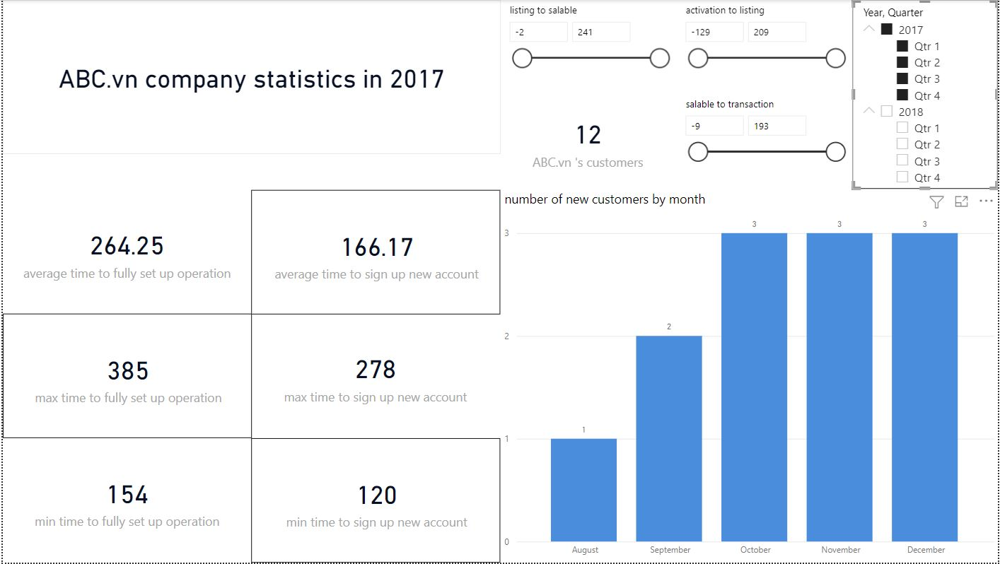
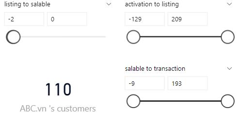

# Logical Thinking & Mini Case-Study

## I. Các bước thực hành

**1. Phân tích dữ liệu và tìm hiểu đề bài**

**2. Làm sạch và chuẩn hóa dữ liệu (Ngôn ngữ sử dụng: Python, Power Query Editor)**

**3. Biểu diễn dữ liệu (PowerBI)**

**4. Phân tích dữ liệu**

## II. Làm sạch và chuẩn hóa dữ liệu 

***1. Sử dụng python để kiểm tra và chuẩn hóa dữ liệu***

```python
# Đọc dữ liệu
pd.read_csv() 

# Review dữ liệu
df.head()
df.shape
df.info()
df.isnull().sum()

# Xuất dữ liệu
df.to_csv()
```

- Ngoài ra còn có các `function()` khác để thống nhất format dữ liệu, kiểm tra dữ liệu lặp, ... 

***2. Sử dụng PowerBI Query Editor để kiểm tra lại dữ liệu***

- Kiểm tra xem đường dẫn đến file và encoding đã đúng chưa 

- Kiểm tra kiểu dữ liệu của các cột 

- Kiểm tra `Column quality`, `Column distribution`, `Column profile`

> ***Nhận xét:*** Dữ liệu ban đầu đã rất gọn gàng, chỉ cần thống nhất lại format của các cột dữ liệu để trảnh xảy ra lỗi sau này khi biểu diễn bằng powerBI

## III. Biểu diễn dữ liệu trên powerBI

***1. Chuẩn bị dữ liệu***

- Tạo các functional column để tính `datediff()` giữa các mốc thời gian quan trọng

- Tạo các measures để tính giá trị Average, Max, Min, set bảng tên, ...

&rarr; Thuận tiện hơn cho việc phân tích thông tin và tìm hiểu insight sau này 

***2. Biểu diễn dữ liệu***

- Sử dụng card để trình bày các thông số thống kê cụ thể như (giá trị trung bình, giá trị lớn nhất, nhỏ nhất, ...)

- Sử dụng các slicers để có thể xem thông tin cụ thể theo từng bộ lọc nhất định hoặc theo từng mốc thời gian

- Sử dụng biểu đồ cột để biểu diễn thông số thống kê theo từng tháng

- Cuối cùng, chỉnh sửa, customize lại bố cục, màu sắc để tránh rối mắt cũng như thuận nhìn hơn khi trình bày báo cáo

## IV. Phân tích dữ liệu



- Trong năm 2017, chỉ có 12 accounts trên tổng số 2145 được lập trong khoảng thời gian từ tháng 8 đến tháng 12. Trong khi đó, thời gian trung bình để công ty **"ABC.vn"** xác nhận tài khoản lên tới 166 ngày(khoảng 5 tháng) &rarr; điều này có thể làm sai lệch đến thông tin mới nhất về công ty **"ABC.vn"**


- Năm 2018, công ty **"ABC.vn"** đón nhận một đột phá trong số lượng khách hàng, từ tháng 1 đến tháng 10 có 2133 người tiếp cận và tạo tài khoản 

- Cũng trong năm 2018, thời gian trung bình cho các công đoạn để set-up tài khoản cũng giảm đáng kể. Chỉ tốn khoảng nửa tháng cho việc tạo tài khoản và khoảng 50 ngày cho đến khi thu về doanh thu cho sản phẩm đầu tiên 

- Tuy nhiên điều này cũng vẫn còn phụ thuộc vào lượng khách hàng truy cập, số lượng khách hàng đăng nhập cũng như tạo tài khoản mới 


- Chỉ trong quý 3, **"ABC.vn"** đã có thêm 925 khách hàng nhưng cùng với đó, mỗi người tốn trung bình 21 ngày để được xác minh và cũng có thể lên tới hơn 5 tháng (160 ngày)




- Năm 2018 chứng kiến 1 lượng lớn tài khoản không được kiểm định hoặc tiến hành theo các bước thông thường của công ty

> Đăng ký &rarr; Account của người bán được kích hoạt bởi ABC team &rarr; Listing sản phẩm (upload thông tin, hình ảnh) &rarr; Chuẩn bị sản phẩm để sẵn sàng bán &rarr; Phát sinh giao dịch

**Tổng kết lại, ta có thể thấy:**

- Lượng khách đăng kí tài khoản thường tập trung vào khoảng thời gian giữa trong năm, đầu năm và cuối năm thấp &rarr; ***tỉ lệ khách hàng không đồng đều*** 

> **Cách khắc phục:**
-Ra mắt nhiều chương trình hỗ trợ bán hàng, cung cấp thêm các dịch vụ như (vận chuyển, hỗ trợ trực tuyến, ...) để giúp đỡ các doanh nhân cũng như thu hút được người mua, từ đó sẽ hấp dẫn được nhiều người bán
-Tăng cường quảng cáo, marketing để có thể tiếp cận đến nhiều người hơn, đặc biết là trong khoảng thời gian đầu và cuối năm

- Các bước làm việc có thể còn chưa hiệu quả, hợp lí &rarr; thời gian tạo tài khoản còn ***vẫn tốn thời gian***

- Thời gian trung bình để sign-up tài khoản mới dao động trong khoảng lớn &rarr; ***chưa ổn định***

- Hơn thế nữa, do sự gia tăng trong số lượng khách hàng, nhiều tài khoản có thể đã được bỏ qua các bước hoặc bị lỗi trong việc kiểm định &rarr; ***không đảm bảo tính xác thực***

> **Cách khắc phục:**
-Xem xét, tổ chức lại các bước khi đăng kí bán hàng
-Tuyển thêm nhân sự, áp dụng công nghệ hiện đại để thúc đẩy tốc độ kiểm định cũng như sự chính xác trong từng giai đoạn

### V. Yêu cầu đề bài


- Trong ngành mỹ phẩm, đã có 1 lượng lớn những nhà phân phối khác cần phải cạnh tranh. 

- Tuy nhiên, trung bình chỉ mất khoảng 8.5 ngày để bán 1 sản phẩm và 13 ngày để đưa sản phẩm chuẩn bị sản phẩm, khá nhanh so với mặt bằng trung các sản phẩm khác trong trang web. 

- Chính vì thế, nếu lấy lợi nhuận thấp (5-15 %), mỗi ngày bán trung bình 50 - 60 sản phẩm/ tuần sẽ có doanh thu gốc khoảng (110%).

- Hơn thế nữa, tại Việt Nam, mỹ phẩm có sức hấp dẫn lớn và lợi nhuận từ ngành này là khá cao &rarr; có thể tăng thêm doanh thu.

- Mặc dù vậy, nhân lực bỏ ra là lớn để có thể phù hợp với các thủ tục của "**ABC.vn**", chuẩn bị sản phẩm hoàn chỉnh và thu hút nguồn khách hàng